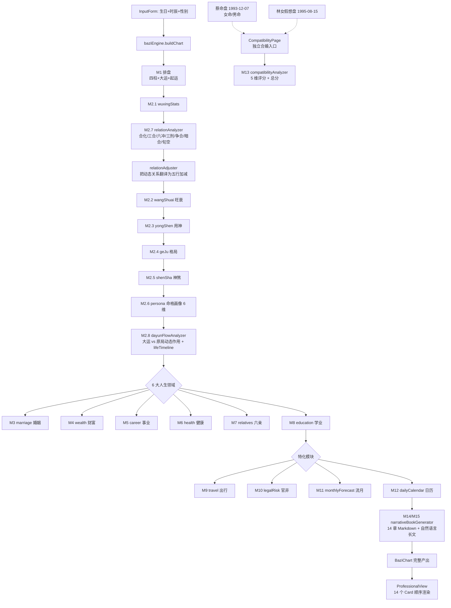

# 八字排盘系统 — M1-M15 功能总览

> **本文档面向**：项目维护者、新加入的开发者、需要快速了解系统能力的命理师顾问。
> **帮助你完成**：在 10 分钟内掌握系统全部 15 个里程碑模块的能力边界、命理学依据、代码位置、产出字段、调用关系。
> **假设你已了解**：基础八字术语（四柱/十神/旺衰/用神/格局）、TypeScript 基础、React 项目结构。

---

## 一、项目能做什么（电梯陈述）

输入「公历生日 + 时辰 + 性别」，输出**一份覆盖人生 14 个维度的完整命理报告**：

```
基础排盘 → 命格画像 → 六大人生领域 → 微观推演 → 合婚 → 自然语言命书
   M1-M2     M2.7-M2.8       M3-M10           M11-M12     M13      M14-M15
```

技术上是**纯前端 TypeScript 引擎**（无后端、无 LLM 依赖），所有命理推断都在 `src/engine/` 中完成，可独立单元测试。

---

## 二、模块速查表

| 里程碑 | 主题 | 核心引擎文件 | UI 组件 | 数据出口（chart.*） |
|---|---|---|---|---|
| **M1** | 排盘基础 | （内置 lunar-javascript） | `PillarsTable`、`InputForm` | `pillars`、`basicInfo`、`startAge` |
| **M2.1** | 五行统计 | `wuxingAnalyzer.ts` | `WuxingChart` | `wuxingStats` |
| **M2.2** | 旺衰判断 | `wangShuaiAnalyzer.ts` | `WangShuaiChain` | `wangShuai` |
| **M2.3** | 用神推断 | `yongShenAnalyzer.ts` | （集成在 PersonaCard） | `yongShen` |
| **M2.4** | 格局判定 | `geJuAnalyzer.ts` | （集成在 PersonaCard） | `geJu` |
| **M2.5** | 神煞分析 | `shenShaAnalyzer.ts` | （集成在各 Card） | `shenShas` |
| **M2.6** | 命格画像（6 维） | `personaAnalyzer.ts` | `PersonaCard` | `persona` |
| **M2.7** | 干支动态关系 V1-V2 | `relationAnalyzer.ts`、`relationAdjuster.ts` | （集成在 PersonaCard） | `relations` |
| **M2.8** | 大运流年联动 | `dayunFlowAnalyzer.ts` | `DayunTimeline`、`LifeTimeline` | `daYuns[].flowAnalysis`、`lifeTimeline` |
| **M3** | 婚姻细论 | `marriageAnalyzer.ts` | `MarriageCard` | `marriage` |
| **M4** | 财富细论 | `wealthAnalyzer.ts` | `WealthCard` | `wealth` |
| **M5** | 事业细论 | `careerAnalyzer.ts` | `CareerCard` | `career` |
| **M6** | 健康细论 | `healthAnalyzer.ts` | `HealthCard` | `health` |
| **M7** | 六亲细论 | `relativesAnalyzer.ts` | `RelativesCard` | `relatives` |
| **M8** | 学业细论 | `educationAnalyzer.ts` | `EducationCard` | `education` |
| **M9** | 出行/搬迁 | `travelAnalyzer.ts` | `TravelCard` | `travel` |
| **M10** | 官非/牢狱 | `legalRiskAnalyzer.ts` | `LegalRiskCard` | `legalRisk` |
| **M11** | 流月预测 | `monthlyForecastAnalyzer.ts` | `MonthlyForecastCard` | `monthlyForecast` |
| **M12** | 日级吉凶日历 | `dailyCalendarAnalyzer.ts` | `DailyCalendarCard` | `dailyCalendar` |
| **M13** | 双盘合婚 | `compatibilityAnalyzer.ts` | `pages/CompatibilityPage` | （独立调用） |
| **M14** | 结构化命书 | `narrativeBookGenerator.ts` | `NarrativeBookCard`（Markdown Tab） | `narrativeBook.markdown` |
| **M15** | 自然语言命书 | `narrativeBookGenerator.ts` | `NarrativeBookCard`（Narrative Tab） | `narrativeBook.narrative` |

---

## 三、调用链路（一张图看懂）



**关键设计**：
- `M2.7 → Adjust → M2.2` 是核心链路改造，**所有下游分析都基于"动态关系修正后的五行"**，避免静态分析失真
- `M2.8 lifeTimeline` 是时间维度的总入口，M11/M12 在其基础上做更细粒度推演
- **M13 走独立页面**，不接入单人 ProfessionalView，因为合婚需要双方 chart

---

## 四、模块详细说明

### 4.1 基础层（M1 - M2.5）

#### M1 · 四柱排盘
- **能力**：公历→农历→四柱、大运排盘（顺逆+起运年龄+8 步）、藏干、纳音、十神
- **输入**：`{ name, gender, birthDate, birthTime, useTrueSolarTime, ziShiSchool }`
- **输出**：`pillars: [Pillar, Pillar, Pillar, Pillar]`、`daYuns: DaYun[]`、`startAge: string`
- **关键设计**：
  - 月柱按节气定（不是农历初一）
  - 子时支持早子时换日 / 晚子时不换日两种学派切换
  - 真太阳时为高级选项

#### M2.1 · 五行统计
- **算法**：天干 +1、地支本气 +1、藏干按强度系数加权（本气 1.0 / 中气 0.6 / 余气 0.3）
- **数据**：`WuXingStat[]` 含 `wuxing / total / percent / originalTotal / originalPercent / adjustments`
- **特殊**：`originalXxx` 保留动态关系修正前的原始值供 UI 对比展示

#### M2.2 · 旺衰判断
- **方法**：四步法（得令 / 得地 / 得生 / 受克）→ 综合结论 + 置信度 1-5★
- **进阶**：M2.7 改造后新增「动态关系修正环节」，记录合化/库冲对最终判定的影响
- **结论档位**：极旺 / 偏旺 / 中和偏旺 / 中和 / 中和偏弱 / 偏弱 / 极弱（专旺/从弱另列）

#### M2.3 · 用神推断
- **方法**：扶抑法 + 调候法 + 通关法，多法同断时给出 `convergence` 标记
- **输出**：`primary[]`、`secondary[]`、`ji[]`（忌神）、`method`、`reason`

#### M2.4 · 格局判定
- **流程**：月令取格 → 透干求清 → 成格/破格 → 格局层次（上/中/下）
- **特殊格**：从旺/从弱/化气/专旺等
- **代码组织**：`geJuAnalyzer.ts` 内部按"正格-偏格-特殊格"三段判别

#### M2.5 · 神煞
- **覆盖**：贵人（天乙/文昌/学堂/词馆）、桃花（咸池/红艳/天喜）、刑煞（羊刃/劫煞/亡神）、驿马、华盖等
- **设计**：每个神煞返回 `{ name, hitPositions, level, description }`，便于下游模块按需筛选

---

### 4.2 命格 + 关系层（M2.6 - M2.8）

#### M2.6 · 命格画像（6 维）
1. **日干意象**（20 条意象库）：如壬水「江河奔涌，志在千里」
2. **格局角色**：从格局推性格基调
3. **十神组合**：如「七杀+正印」→ 杀印相生型
4. **心性标签**（mentality）：5-8 个标签
5. **优势 / 注意**（strengths / cautions）：可执行建议
6. **干支关系网**（M2.7 后新增）：6 大关系类型分布矩阵

#### M2.7 · 干支动态关系系统（V1 → V2 四档迭代）

| 子版本 | 增量 | 文件 |
|---|---|---|
| V1 | 合化 / 三合 / 六合 / 六冲 / 三刑 检测 | `relationAnalyzer.ts` |
| V1.5 | 远近权重 + 通根透干 + 外显实质四级标注（manifest-strong/weak/hidden-strong/weak/absent-empty） | 同上 |
| V1.8 | 把关系翻译为五行加减项，改造下游所有分析 | `relationAdjuster.ts` |
| V2 | 争合 / 妒合 / 暗合 / 旬空 4 个高级 detector | 同上 |

**核心价值**：让旺衰/用神/格局判定**不再只看静态字面五行**，而是反映"原局发生作用后"的真实力量。

#### M2.8 · 大运流年联动 + 人生时间轴
- **dayunFlowAnalyzer**：每步大运 vs 原局做关系检测，得出 `wuxingRole`（用/喜/闲/仇/忌）+ `score 1-5`
- **填实空亡**：大运/流年带来空亡支时该位激活，命理学价值最高的事件触发器
- **lifeTimeline**：80 年时间轴，标注 8 步大运 + 关键流年节点

---

### 4.3 六大人生领域（M3 - M8）

所有领域模块**统一框架**：`星 + 宫 + 动态 + 评分 + 风险`。

| 模块 | 核心星 | 宫位 | 评分维度 | 关键事件触发 |
|---|---|---|---|---|
| **M3 婚姻** | 配偶星（男看正/偏财，女看正/七杀） | 日支 | 配偶画像 / 婚期 / 质量 / 风险 | 大运/流年合冲日支 |
| **M4 财富** | 财星（正财/偏财） | 财库（辰戌丑未藏财） | 财源类型 / 求财方位 / 周期 | 财星到位的大运 |
| **M5 事业** | 官杀（正官/七杀） | 月柱 | 创业 vs 打工 / 行业匹配 / 升迁年 | 官印相生大运 |
| **M6 健康** | 五行偏枯 → 脏腑 | 日柱 | 体质分类 / 危险年 / 调养方向 | 忌神过旺流年 |
| **M7 六亲** | 父母（印星）/ 兄弟（比劫）/ 子女（食伤/官杀） | 年柱/月柱/时柱 | 4 位亲属各自亲缘厚薄 | — |
| **M8 学业** | 印星（正/偏） | 月柱 | 学业类型 / 升学关键年 | 文昌/学堂/词馆叠加 |

---

### 4.4 特化与微观（M9 - M12）

#### M9 · 出行/搬迁
- **驿马**：寅申巳亥四长生中与命主三合局对冲者
- **海外缘**：日支或时支带驿马 + 大运冲驿马
- **触发**：大运/流年带驿马 → 必有搬迁/出差/出国

#### M10 · 官非/牢狱
- **原局风险因子**：羊刃 + 劫煞 + 三刑齐 + 伤官见官
- **流年触发**：伤官冲官星、反吟（天干同+地支冲）、刑冲日柱
- **风险等级**：5 档（无虞 / 留意 / 警惕 / 高度警惕 / 严重）

#### M11 · 流月预测（精度到月）
- **算法**：流月地支 vs 日支的合/冲/刑/害/三合/三会
- **输出**：12 月份 tendency + 最吉/最忌月 + summary

#### M12 · 日级吉凶日历
- **算法**：当月每日干支 vs 命主用神/忌神 + 黄道吉日
- **输出**：每日 fortune 5 档（大吉/吉/平/凶/大凶）+ 宜忌

---

### 4.5 合婚与命书（M13 - M15）

#### M13 · 双盘合婚（独立页面）
- **5 维评分**（满分 100）：
  1. 生肖年柱（10 分）
  2. 日柱夫妻宫天合地合（10 分）
  3. 用神互补度（10 分）
  4. 旺衰互补（10 分）
  5. 桃花情感（10 分）
- **缘分类型**：互补型 / 同频型 / 助力型 / 中性型 / 相克型
- **入口**：`/compatibility` 路由，独立 Page，不在 ProfessionalView 内

#### M14 · 结构化命书（Markdown）
- **结构**：14 章
  ```
  一、四柱排盘  二、五行与旺衰  三、用神与格局  四、性格命格
  五、婚姻      六、财富        七、事业        八、健康
  九、六亲      十、学业        十一、出行/搬迁  十二、官非牢狱
  十三、大运流年 十四、综合论命
  ```
- **输出长度**：约 5000 字（蔡命盘实测 5278 字）
- **特性**：纯字段拼接、无臆造、可一键导出 `.md`

#### M15 · 自然语言命书
- **特性**：基于 chart 同源数据，生成可读性强的自然语言长文（约 1800 字）
- **设计**：模板生成，预留 LLM 接入点（未启用）

---

## 五、典型调用方式

### 5.1 引擎调用（纯逻辑层）

```typescript
import { buildChartWithFallback } from './src/engine/baziEngine';

const chart = buildChartWithFallback({
  name: '蔡蔡',
  gender: '男',
  birthDate: '1993-12-07',
  birthTime: '06:00',
  birthPlace: '',
  focusAreas: ['事业'],
  useTrueSolarTime: false,
  ziShiSchool: 'early',
});

// 任意取用：
console.log(chart.wangShuai.conclusion);          // "日主极旺（水势汪洋，易成专旺）"
console.log(chart.marriage.spousePortrait);       // 配偶画像
console.log(chart.education.scholarType);         // "才艺学者（伤官佩印）"
console.log(chart.narrativeBook.markdown);        // 5000+ 字命书
```

### 5.2 合婚调用

```typescript
import { analyzeCompatibility } from './src/engine/compatibilityAnalyzer';

const man = buildChartWithFallback({ /* ... 男方 */ });
const woman = buildChartWithFallback({ /* ... 女方 */ });
const result = analyzeCompatibility(man, woman);

console.log(result.totalScore);     // 70 / 100
console.log(result.affinityType);   // "互补型（用神补忌神）"
console.log(result.scores);         // 5 维度详细评分
```

### 5.3 端到端校验

```bash
cd app
npx tsx verify-m8-m15.ts
```

蔡命盘（癸酉 癸亥 壬戌 癸卯，男）的标准产出可作为回归基线。

---

## 六、命理学方法论参考

所有规则的命理学依据见 [`./命理分析方法论.md`](./命理分析方法论.md)，主要参考：

- 《滴天髓》—— 旺衰、用神、格局
- 《子平真诠》—— 格局成败救应
- 《三命通会》—— 神煞、纳音、六亲

每个 analyzer 文件头部注释会标注核心规则的文档章节锚点（如 `§3.3.1 比劫不立正格`）。

---

## 七、数据流与类型契约

完整类型定义见 [`app/src/types/bazi.ts`](../app/src/types/bazi.ts)（约 1500 行）。

**核心顶层类型**：

```typescript
interface BaziChart {
  basicInfo: BasicInfo;
  pillars: [Pillar, Pillar, Pillar, Pillar];
  wuxingStats: WuXingStat[];        // M2.1
  wangShuai: WangShuai;              // M2.2
  yongShen: YongShen;                // M2.3
  geJu: GeJu;                        // M2.4
  shenShas: ShenSha[];               // M2.5
  persona: Persona;                  // M2.6
  relations: ChartRelations;         // M2.7
  daYuns: DaYun[];                   // M1 + M2.8 (flowAnalysis)
  lifeTimeline: LifeTimeline;        // M2.8
  marriage: MarriageAnalysis;        // M3
  wealth: WealthAnalysis;            // M4
  career: CareerAnalysis;            // M5
  health: HealthAnalysis;            // M6
  relatives: RelativesAnalysis;      // M7
  education: EducationAnalysis;      // M8
  travel: TravelAnalysis;            // M9
  legalRisk: LegalRiskAnalysis;      // M10
  monthlyForecast: MonthlyForecastAnalysis;  // M11
  dailyCalendar: DailyCalendarAnalysis;      // M12
  narrativeBook: NarrativeBook;              // M14/M15
  // ... 其他元数据
}
```

合婚结果不挂在 `BaziChart` 上，由 `analyzeCompatibility(man, woman)` 独立返回 `CompatibilityAnalysis`。

---

## 八、目录结构速查

```
app/src/
├── engine/                          # M1-M15 所有命理引擎（纯逻辑）
│   ├── baziEngine.ts                # 总入口：buildChartWithFallback
│   ├── wuxingAnalyzer.ts            # M2.1
│   ├── wangShuaiAnalyzer.ts         # M2.2
│   ├── yongShenAnalyzer.ts          # M2.3
│   ├── geJuAnalyzer.ts              # M2.4
│   ├── shenShaAnalyzer.ts           # M2.5
│   ├── personaAnalyzer.ts           # M2.6
│   ├── relationAnalyzer.ts          # M2.7
│   ├── relationAdjuster.ts          # M2.7 五行修正器
│   ├── dayunFlowAnalyzer.ts         # M2.8
│   ├── marriageAnalyzer.ts          # M3
│   ├── wealthAnalyzer.ts            # M4
│   ├── careerAnalyzer.ts            # M5
│   ├── healthAnalyzer.ts            # M6
│   ├── relativesAnalyzer.ts         # M7
│   ├── educationAnalyzer.ts         # M8
│   ├── travelAnalyzer.ts            # M9
│   ├── legalRiskAnalyzer.ts         # M10
│   ├── monthlyForecastAnalyzer.ts   # M11
│   ├── dailyCalendarAnalyzer.ts     # M12
│   ├── compatibilityAnalyzer.ts     # M13
│   └── narrativeBookGenerator.ts    # M14/M15
│
├── components/ProfessionalView/     # 14 个 Card + 容器
│   ├── ProfessionalView.tsx         # 总容器（顺序渲染所有 Card）
│   ├── PillarsTable.tsx             # M1
│   ├── WuxingChart.tsx              # M2.1
│   ├── WangShuaiChain.tsx           # M2.2
│   ├── PersonaCard.tsx              # M2.3-M2.7（用神/格局/画像/关系合并）
│   ├── DayunTimeline.tsx            # M2.8 大运表
│   ├── LifeTimeline.tsx             # M2.8 时间轴
│   ├── MarriageCard.tsx             # M3
│   ├── WealthCard.tsx               # M4
│   ├── CareerCard.tsx               # M5
│   ├── HealthCard.tsx               # M6
│   ├── RelativesCard.tsx            # M7
│   ├── EducationCard.tsx            # M8
│   ├── TravelCard.tsx               # M9
│   ├── LegalRiskCard.tsx            # M10
│   ├── MonthlyForecastCard.tsx      # M11
│   ├── DailyCalendarCard.tsx        # M12
│   └── NarrativeBookCard.tsx        # M14/M15（双 Tab）
│
└── pages/
    └── CompatibilityPage.tsx        # M13 独立合婚页
```

---

## 九、扩展指南

### 新增一个领域模块（参考 M8-M10 模式）

1. **类型定义**：`types/bazi.ts` 新增 `XxxAnalysis` 接口，挂到 `BaziChart`
2. **引擎实现**：`engine/xxxAnalyzer.ts` 实现 `analyzeXxx(pillars, daYuns, relations, ...): XxxAnalysis`
3. **接入排盘**：`baziEngine.ts` 中调用 + 返回值挂到 chart
4. **UI 组件**：`components/ProfessionalView/XxxCard.tsx`
5. **接入视图**：`ProfessionalView.tsx` 中按位置插入 `<XxxCard analysis={chart.xxx} />`
6. **校验**：在 `verify-m8-m15.ts` 中加一段输出，跑 `npx tsx verify-m8-m15.ts` 确认

### 性能基线
- 完整 chart 生成：< 100ms（纯前端，无网络）
- 命书生成（M14+M15）：< 50ms
- 合婚分析：< 50ms

---

## 十、变更记录

| 日期 | 版本 | 内容 |
|------|------|------|
| 2026-05-03 | v1.0 | 首次整理 M1-M15 全模块总览，配合架构图与类型契约 |
