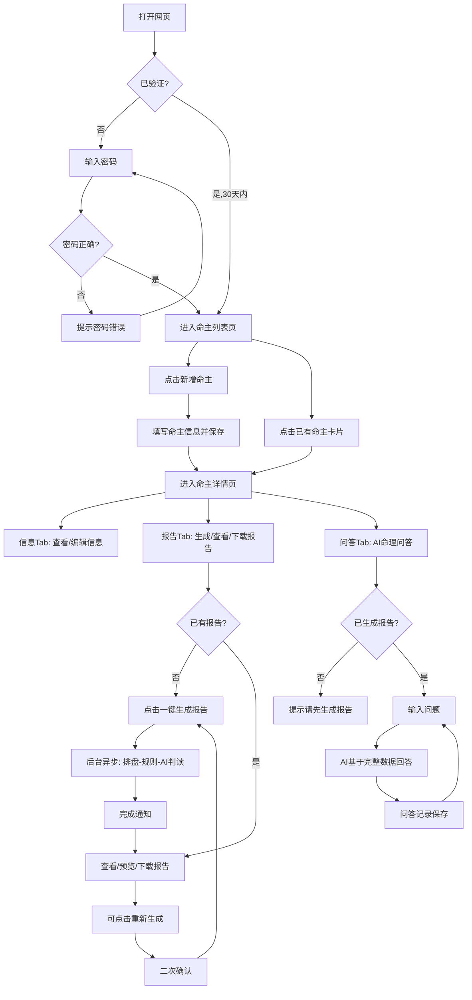
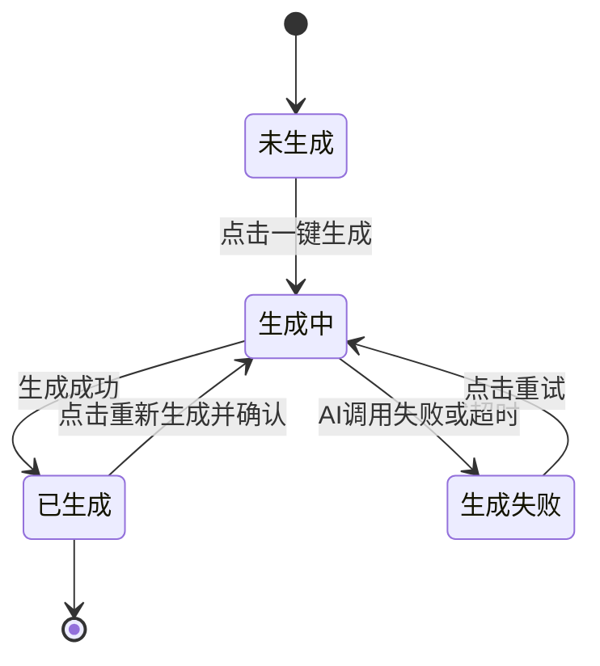
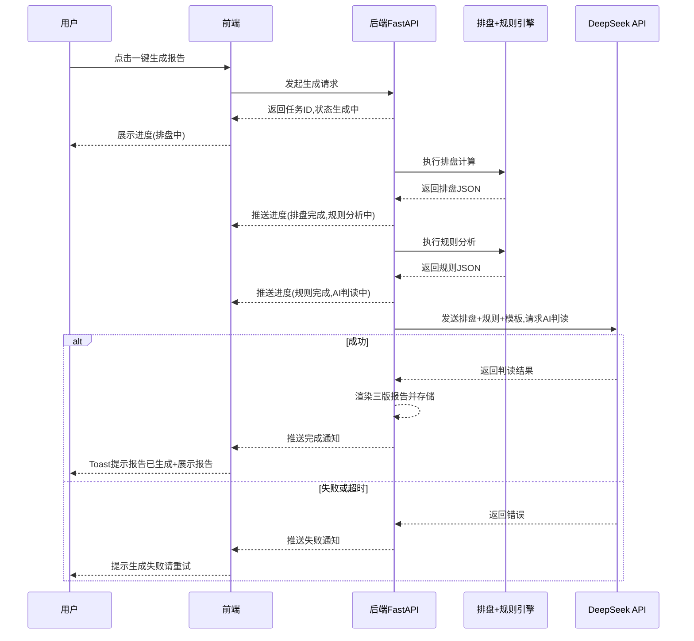

# 产品需求文档：我命由天挺好的 - V1.0

## 1. 综述 (Overview)

### 1.1 项目背景与核心问题

**产品名称**：我命由天挺好的

**产品宣传文案**：「八字一键排，命理自然来。」—— 随时随地，一部手机，为每个人写一份专属命书。

**核心问题**：当前八字命理分析系统只能在本地电脑上通过 Aone Copilot 进行逐个 case 分析，受限于单机环境，无法在手机或其他电脑上使用。需要一个网页版工具，让命理师（即产品使用者本人）可以在任意设备上一键完成命理报告生成和命理问答。

**产品定位**：个人命理师专用的 Web 端八字命理报告生成工具。核心用户只有一个人（产品创建者本人），但部署在公网，支持手机和电脑随时随地访问。

**核心能力**：
1. **一键生成报告**：输入命主信息 → 自动排盘+规则分析+DeepSeek AI 判读 → 输出三版报告（命理师版/消费者版/微信版）
2. **AI 命理问答**：基于命主完整数据（排盘+规则+报告），与 AI 进行多轮命理问答
3. **命主管理**：多命主建档、历史报告和问答记录持久化

**技术方案**：

| 层次 | 选型 | 理由 |
|---|---|---|
| 后端 | Python FastAPI + SQLite | 复用已有 Python 排盘引擎（`engine/paipan.py` + `engine/rules.py`），零迁移成本；SQLite 单人使用足够 |
| 前端 | React + TailwindCSS | 移动端优先，手机体验友好 |
| AI | DeepSeek API | 复用已有 API Key |
| 部署 | Railway / Render | 从零开始最省事，免费额度够个人使用，自动 HTTPS |

### 1.2 核心业务流程 / 用户旅程地图

1. **阶段一：入口（密码验证）** — 输入密码进入系统，防止公网裸奔
2. **阶段二：管理（命主列表）** — 查看所有已建档命主，新增命主
3. **阶段三：建档（录入命主信息）** — 填写命主基本信息并保存
4. **阶段四：查看与编辑（命主详情-信息Tab）** — 查看/编辑命主信息
5. **阶段五：生成（报告Tab）** — 一键生成三版报告，在线预览与下载
6. **阶段六：问答（AI问答Tab）** — 基于完整数据的 AI 命理问答
HEREDOC; __aone_exit=$?; pwd -P > '/var/folders/mb/hz2jx3r543gdvbsthr7zqqx40000gp/T/aone-copilot-cwd-1778577721484-jpmou5pc35s.txt' 2>/dev/null; exit $__aone_exit
### 1.3 Mermaid 图

#### 1.3.1 用户操作流（核心流程）



#### 1.3.2 报告生成状态机



#### 1.3.3 报告生成时序



---

## 2. 用户故事详述 (User Stories)

### 阶段一：入口

---

#### **US-01: 作为用户，我希望通过密码验证后才能进入系统，以便于防止公网裸奔、保护隐私数据。**

*   **价值陈述 (Value Statement)**:
    *   **作为** 唯一的产品使用者
    *   **我希望** 打开网页后输入密码才能使用系统
    *   **以便于** 防止部署在公网后被他人随意访问

*   **业务规则与逻辑 (Business Logic)**:
    1.  **前置条件**: 用户访问系统任意页面。
    2.  **操作流程 (Happy Path)**:
        1. 用户打开网页，系统检测本地是否存在有效的验证 token。
        2. 若无有效 token，展示密码输入页面。
        3. 用户输入密码 `123456`，点击「进入」。
        4. 系统验证密码正确，生成 token 存储到本地（有效期 30 天）。
        5. 跳转到命主列表页。
    3.  **异常处理 (Error Handling)**:
        * 密码输入错误：提示"密码错误，请重试"，输入框清空，焦点保持在输入框。
        * Token 过期（30 天后）：自动跳转到密码输入页，用户需重新输入密码。
        * 无网络时：提示"网络异常，请检查网络连接"。

*   **验收标准 (Acceptance Criteria)**:
    *   **场景1: 首次访问**
        *   **GIVEN** 用户首次访问系统（无本地 token）
        *   **WHEN** 用户打开网页
        *   **THEN** 展示密码输入页面，不展示任何数据内容
    *   **场景2: 密码正确**
        *   **GIVEN** 用户在密码输入页
        *   **WHEN** 输入 `123456` 并点击「进入」
        *   **THEN** 跳转到命主列表页，后续 30 天内再次访问无需输入密码
    *   **场景3: 密码错误**
        *   **GIVEN** 用户在密码输入页
        *   **WHEN** 输入错误密码并点击「进入」
        *   **THEN** 提示"密码错误，请重试"，输入框清空
    *   **场景4: Token 过期**
        *   **GIVEN** 用户上次验证已超过 30 天
        *   **WHEN** 用户访问系统
        *   **THEN** 自动跳转到密码输入页

---

*   **页面布局线框图 (ASCII Wireframe)**:

```text
+-------------------------------+
|                               |
|                               |
|     我命由天挺好的             |
|                               |
|     +-----------------------+ |
|     | 请输入密码            | |
|     +-----------------------+ |
|                               |
|         [ 进入 ]              |
|                               |
|                               |
+-------------------------------+
```

HEREDOC; __aone_exit=$?; pwd -P > '/var/folders/mb/hz2jx3r543gdvbsthr7zqqx40000gp/T/aone-copilot-cwd-1778577758966-2jekonk07d7.txt' 2>/dev/null; exit $__aone_exit
### 阶段二：建档

---

#### **US-02: 作为用户，我希望新增一个命主并录入基本信息，以便于后续为其生成命理报告。**

*   **价值陈述 (Value Statement)**:
    *   **作为** 命理师
    *   **我希望** 填写命主的出生信息并保存建档
    *   **以便于** 系统基于这些信息进行排盘计算和报告生成

*   **业务规则与逻辑 (Business Logic)**:
    1.  **前置条件**: 用户已通过密码验证。
    2.  **操作流程 (Happy Path)**:
        1. 用户在命主列表页点击「+ 新增命主」。
        2. 系统展示信息录入表单。
        3. 用户填写必填字段：姓名、性别（男/女）、出生日期（年月日）、出生时间（时:分）、日历类型（公历/农历，默认公历）、出生城市。
        4. 用户可选择填写「备注」（自由文本，如职业、婚姻状况、关注领域等）。
        5. 点击「保存」，系统创建命主记录。
        6. 自动跳转到该命主的详情页。
    3.  **异常处理 (Error Handling)**:
        * 必填字段未填写：对应字段下方显示红色提示"请填写此项"，「保存」按钮禁用。
        * 日期不合法（如2月30日）：提示"请输入有效的日期"。
        * 出生年份超出引擎支持范围（1900-2100）：提示"出生年份需在 1900-2100 之间"。
        * 网络异常导致保存失败：提示"保存失败，请重试"，表单数据不丢失。

*   **字段定义**:

| 字段 | 必填 | 类型 | 约束 | 说明 |
|---|---|---|---|---|
| 姓名 | 是 | 文本 | 1-20字符 | 命主姓名 |
| 性别 | 是 | 单选 | 男/女 | |
| 出生日期 | 是 | 日期选择器 | 1900-2100年 | 年月日 |
| 出生时间 | 是 | 时间选择器 | 00:00-23:59 | 时:分，移动端用滚轮选择器 |
| 日历类型 | 是 | 单选 | 公历/农历 | 默认公历 |
| 出生城市 | 是 | 文本 | 1-20字符 | 如"杭州"、"北京" |
| 备注 | 否 | 多行文本 | 最多500字符 | 职业、婚姻、关注领域等辅助信息 |

*   **验收标准 (Acceptance Criteria)**:
    *   **场景1: 成功建档**
        *   **GIVEN** 用户在新增命主页面
        *   **WHEN** 填写完所有必填字段并点击「保存」
        *   **THEN** 系统创建命主记录，自动跳转到该命主详情页
    *   **场景2: 必填字段缺失**
        *   **GIVEN** 用户未填写姓名
        *   **WHEN** 点击「保存」
        *   **THEN** 姓名字段下方显示"请填写此项"，不执行保存
    *   **场景3: 农历输入**
        *   **GIVEN** 用户选择日历类型为"农历"
        *   **WHEN** 填写农历日期并保存
        *   **THEN** 系统记录为农历日期，排盘时自动转换为公历计算
    *   **场景4: 保存失败**
        *   **GIVEN** 网络异常
        *   **WHEN** 用户点击保存
        *   **THEN** 提示"保存失败，请重试"，表单数据保留不丢失

---

*   **页面布局线框图 (ASCII Wireframe)**:

```text
+-------------------------------+
| <- 返回        新增命主        |
+-------------------------------+
|                               |
|  姓名 *                       |
|  +-------------------------+  |
|  | 请输入姓名              |  |
|  +-------------------------+  |
|                               |
|  性别 *     ( ) 男  ( ) 女    |
|                               |
|  日历类型 *  (x) 公历 ( ) 农历 |
|                               |
|  出生日期 *                    |
|  +-------------------------+  |
|  | 1993 年 12 月 07 日     |  |
|  +-------------------------+  |
|                               |
|  出生时间 *                    |
|  +-------------------------+  |
|  | 06 时 00 分             |  |
|  +-------------------------+  |
|                               |
|  出生城市 *                    |
|  +-------------------------+  |
|  | 请输入城市              |  |
|  +-------------------------+  |
|                               |
|  备注（选填）                  |
|  +-------------------------+  |
|  | 职业、婚姻状况、关注     |  |
|  | 领域等辅助信息...        |  |
|  +-------------------------+  |
|                               |
|      [    保存    ]           |
|                               |
+-------------------------------+
```

HEREDOC; __aone_exit=$?; pwd -P > '/var/folders/mb/hz2jx3r543gdvbsthr7zqqx40000gp/T/aone-copilot-cwd-1778577798241-9fddek6x1fh.txt' 2>/dev/null; exit $__aone_exit
### 阶段三：管理

---

#### **US-03: 作为用户，我希望在一个列表页查看所有已建档的命主，以便于快速找到目标命主并进入详情。**

*   **价值陈述 (Value Statement)**:
    *   **作为** 命理师
    *   **我希望** 看到所有命主的概览列表
    *   **以便于** 快速选择目标命主、了解每个命主的报告状态

*   **业务规则与逻辑 (Business Logic)**:
    1.  **前置条件**: 用户已通过密码验证。
    2.  **操作流程 (Happy Path)**:
        1. 密码验证通过后，自动进入命主列表页。
        2. 列表按创建时间倒序排列（最新建档的在最上面）。
        3. 每条卡片展示：姓名、性别、出生日期、报告状态（未生成/生成中/已生成）。
        4. 点击卡片 → 进入该命主详情页。
        5. 点击右上角「+ 新增」→ 进入建档页面。
    3.  **异常处理 (Error Handling)**:
        * 列表为空（无任何命主）：展示空态引导"还没有命主记录，点击右上角 + 新增"。
        * 加载失败：提示"加载失败，请下拉刷新"。

*   **验收标准 (Acceptance Criteria)**:
    *   **场景1: 正常展示列表**
        *   **GIVEN** 系统中有 3 个命主
        *   **WHEN** 用户进入列表页
        *   **THEN** 按创建时间倒序展示 3 张卡片，每张显示姓名、性别、出生日期、报告状态
    *   **场景2: 空态**
        *   **GIVEN** 系统中无任何命主
        *   **WHEN** 用户进入列表页
        *   **THEN** 展示空态引导文案和新增按钮
    *   **场景3: 报告状态实时**
        *   **GIVEN** 某命主的报告正在后台生成中
        *   **WHEN** 用户查看列表
        *   **THEN** 该命主卡片显示"生成中 🔄"状态

---

*   **页面布局线框图 (ASCII Wireframe)**:

```text
+-------------------------------+
| 我命由天挺好的          [+新增] |
+-------------------------------+
|                               |
| +---------------------------+ |
| | 张三  男                  | |
| | 1993-12-07 (公历)        | |
| | 已生成报告 ✅             | |
| +---------------------------+ |
|                               |
| +---------------------------+ |
| | 李四  女                  | |
| | 1988-05-20 (公历)        | |
| | 未生成 ⏳                 | |
| +---------------------------+ |
|                               |
| +---------------------------+ |
| | 王五  男                  | |
| | 1975-10-26 (农历)        | |
| | 生成中 🔄                 | |
| +---------------------------+ |
|                               |
+-------------------------------+
```

HEREDOC; __aone_exit=$?; pwd -P > '/var/folders/mb/hz2jx3r543gdvbsthr7zqqx40000gp/T/aone-copilot-cwd-1778577821756-fm9j76nlh0i.txt' 2>/dev/null; exit $__aone_exit
### 阶段四：查看与编辑

---

#### **US-04: 作为用户，我希望在命主详情页查看和编辑命主的基本信息，以便于修正或补充信息后重新生成更准确的报告。**

*   **价值陈述 (Value Statement)**:
    *   **作为** 命理师
    *   **我希望** 随时查看和修改命主信息
    *   **以便于** 纠正录入错误或补充新信息以提升报告质量

*   **业务规则与逻辑 (Business Logic)**:
    1.  **前置条件**: 命主记录已存在。
    2.  **操作流程 (Happy Path)**:
        1. 用户从命主列表点击某命主卡片，进入详情页。
        2. 详情页包含三个 Tab：「信息」「报告」「问答」，默认显示「信息」Tab。
        3. 信息 Tab 展示该命主的所有字段（只读态）。
        4. 用户点击「编辑信息」，字段变为可编辑状态。
        5. 修改完成后点击「保存」，系统更新命主信息。
        6. 若该命主已有报告，保存后展示提示"信息已更新，建议重新生成报告"。
    3.  **异常处理 (Error Handling)**:
        * 编辑时清空必填字段：同 US-02 校验逻辑。
        * 保存失败：提示"保存失败，请重试"，编辑态保持。

*   **验收标准 (Acceptance Criteria)**:
    *   **场景1: 查看信息**
        *   **GIVEN** 用户进入某命主详情页
        *   **WHEN** 默认展示信息 Tab
        *   **THEN** 以只读方式展示所有字段（姓名、性别、出生时间、城市、备注等）
    *   **场景2: 编辑并保存**
        *   **GIVEN** 用户点击「编辑信息」
        *   **WHEN** 修改备注字段并点击「保存」
        *   **THEN** 信息更新成功，回到只读态
    *   **场景3: 编辑后提示重新生成**
        *   **GIVEN** 命主已有已生成的报告
        *   **WHEN** 用户修改信息并保存成功
        *   **THEN** 展示提示"信息已更新，建议重新生成报告"

---

*   **页面布局线框图 (ASCII Wireframe)**:

```text
+-------------------------------+
| <- 返回          张三          |
+-------------------------------+
| [ 信息 ]  [ 报告 ]  [ 问答 ]  |
+-------------------------------+
|                               |
|  姓名      张三               |
|  性别      男                 |
|  出生日期  1993-12-07 (公历)  |
|  出生时间  06:00              |
|  出生城市  杭州               |
|  备注      程序员,已婚        |
|                               |
|  创建时间  2026-05-10         |
|                               |
|  +-------------------------+  |
|  |      编辑信息            |  |
|  +-------------------------+  |
|                               |
|  ┌───────────────────────┐    |
|  │ ⚠ 信息已更新,建议     │    |
|  │   重新生成报告         │    |
|  └───────────────────────┘    |
|                               |
+-------------------------------+
```

HEREDOC; __aone_exit=$?; pwd -P > '/var/folders/mb/hz2jx3r543gdvbsthr7zqqx40000gp/T/aone-copilot-cwd-1778577846462-mrxdsw6h77.txt' 2>/dev/null; exit $__aone_exit
### 阶段五：报告生成

---

#### **US-05: 作为用户，我希望一键生成命理报告并在线查看和下载，以便于快速获得完整的命理分析结果。**

*   **价值陈述 (Value Statement)**:
    *   **作为** 命理师
    *   **我希望** 点一个按钮就能自动完成排盘、规则分析和AI判读，生成三版报告
    *   **以便于** 省去手动操作排盘引擎和AI填充的繁琐流程

*   **业务规则与逻辑 (Business Logic)**:
    1.  **前置条件**: 命主信息已录入（必填字段完整）。
    2.  **操作流程 (Happy Path)**:
        1. 用户在命主详情页切换到「报告」Tab。
        2. 若未生成过报告，展示空态和「一键生成报告」按钮。
        3. 用户点击「一键生成报告」，系统在后台异步执行：
            - Step 1：排盘计算（engine/paipan.py）
            - Step 2：规则分析（engine/rules.py）
            - Step 3：Jinja2 模板渲染骨架
            - Step 4：调用 DeepSeek API 填充判读槽位
            - Step 5：组装三版最终报告（命理师版/消费者版/微信版）
        4. 前端实时展示生成进度（排盘✅ → 规则✅ → AI判读⏳）。
        5. 用户可离开当前页面，生成完成后 Toast 通知。
        6. 完成后展示三版报告列表，每版支持在线预览（Markdown渲染）和下载（.md文件）。
        7. 微信版额外支持「一键复制」（复制纯文本到剪贴板）。
    3.  **异常处理 (Error Handling)**:
        * DeepSeek API 调用失败/超时：状态变为"生成失败"，展示「重试」按钮，提示"AI判读失败，请稍后重试"。
        * 排盘计算失败（日期非法等）：提示"排盘失败，请检查命主出生信息"，引导用户回到信息Tab修改。
        * 网络中断：提示"网络异常"，保留已完成的步骤状态。
    4.  **重新生成**:
        * 已有报告时，「报告」Tab 展示「重新生成」按钮。
        * 点击后弹出二次确认："重新生成将覆盖当前报告，确定？"
        * 确认后覆盖旧报告，重新执行全流程。
    5.  **信息变更提示**:
        * 当命主信息在报告生成后被修改，「报告」Tab 顶部显示提示条："信息已更新，建议重新生成报告"。

*   **验收标准 (Acceptance Criteria)**:
    *   **场景1: 首次生成**
        *   **GIVEN** 命主已建档且未生成过报告
        *   **WHEN** 用户点击「一键生成报告」
        *   **THEN** 后台开始异步生成，前端展示实时进度，完成后展示三版报告
    *   **场景2: 生成中离开页面**
        *   **GIVEN** 报告正在后台生成中
        *   **WHEN** 用户切换到其他Tab或返回列表页
        *   **THEN** 生成不中断，完成后 Toast 通知用户
    *   **场景3: 在线预览**
        *   **GIVEN** 报告已生成
        *   **WHEN** 用户点击「命理师版」
        *   **THEN** 在页面内展开渲染后的 Markdown 报告内容
    *   **场景4: 下载报告**
        *   **GIVEN** 报告已生成
        *   **WHEN** 用户点击下载按钮
        *   **THEN** 浏览器下载对应的 .md 文件
    *   **场景5: 微信版复制**
        *   **GIVEN** 微信版报告已生成
        *   **WHEN** 用户点击「复制」按钮
        *   **THEN** 纯文本内容复制到剪贴板，Toast提示"已复制"
    *   **场景6: 重新生成**
        *   **GIVEN** 命主已有报告
        *   **WHEN** 用户点击「重新生成」并确认
        *   **THEN** 覆盖旧报告，重新执行全流程
    *   **场景7: AI调用失败**
        *   **GIVEN** 生成过程中 DeepSeek API 返回错误
        *   **WHEN** 系统检测到失败
        *   **THEN** 状态变为"生成失败"，展示错误提示和「重试」按钮

---

*   **页面布局线框图 (ASCII Wireframe)**:

**已生成状态**:
```text
+-------------------------------+
| <- 返回          张三          |
+-------------------------------+
| [ 信息 ]  [*报告*]  [ 问答 ]  |
+-------------------------------+
|                               |
| +---------------------------+ |
| | ✅ 报告已生成              | |
| | 生成时间: 05-12 16:30     | |
| |      [ 🔄 重新生成 ]      | |
| +---------------------------+ |
|                               |
| +---------------------------+ |
| | 📄 命理师版               | |
| |   [在线查看]    [下载 ⬇]  | |
| +---------------------------+ |
|                               |
| +---------------------------+ |
| | 📄 消费者版               | |
| |   [在线查看]    [下载 ⬇]  | |
| +---------------------------+ |
|                               |
| +---------------------------+ |
| | 📄 微信版                 | |
| |   [在线查看]    [复制 📋]  | |
| +---------------------------+ |
|                               |
+-------------------------------+
```

**生成中状态**:
```text
+-------------------------------+
| <- 返回          张三          |
+-------------------------------+
| [ 信息 ]  [*报告*]  [ 问答 ]  |
+-------------------------------+
|                               |
|      🔄 报告生成中...         |
|                               |
|      排盘计算    ✅            |
|      规则分析    ✅            |
|      AI判读      ⏳ 进行中... |
|                               |
|      预计还需 1-2 分钟        |
|      完成后会通知您            |
|                               |
+-------------------------------+
```

HEREDOC; __aone_exit=$?; pwd -P > '/var/folders/mb/hz2jx3r543gdvbsthr7zqqx40000gp/T/aone-copilot-cwd-1778577887013-14s8bwzwesqj.txt' 2>/dev/null; exit $__aone_exit
### 阶段六：AI问答

---

#### **US-06: 作为用户，我希望基于命主的完整数据向AI提问命理问题并获得专业回答，以便于深入了解命主的具体命理状况。**

*   **价值陈述 (Value Statement)**:
    *   **作为** 命理师
    *   **我希望** 针对某个命主的排盘数据、规则分析和已生成报告，向AI追问具体的命理问题
    *   **以便于** 获得更细致、更有针对性的命理解读

*   **业务规则与逻辑 (Business Logic)**:
    1.  **前置条件**: 该命主已生成过报告（报告状态为"已生成"）。
    2.  **操作流程 (Happy Path)**:
        1. 用户在命主详情页切换到「问答」Tab。
        2. 页面展示历史问答记录（如有），底部为输入框。
        3. 用户输入问题（如"今年适合跳槽吗？"），点击「发送」。
        4. AI 基于以下上下文生成回答：
            - 排盘 JSON 数据
            - 规则分析结果
            - 已生成的三版完整报告
            - 之前的问答历史（最近 N 轮，避免超出上下文窗口）
        5. AI 回答以专业命理师风格呈现（术语+人话翻译，复用 prompts/judge.md 的三条铁律）。
        6. 问答记录自动保存到数据库。
        7. 用户可继续追问，形成多轮对话。
    3.  **异常处理 (Error Handling)**:
        * 未生成报告时进入问答Tab：展示提示"请先生成报告后再使用问答功能"，按钮跳转到报告Tab。
        * AI 调用失败/超时：在对话中展示"回答失败，请重试"，附带「重试」按钮。
        * 输入为空：「发送」按钮禁用。
    4.  **上下文策略**:
        * 系统 Prompt：排盘数据 + 规则分析 + 三版报告（始终带入）
        * 对话历史：最近 20 轮（超出后截断最早的对话）
        * AI 风格：专业命理师，三条铁律（P1命理是骨架人话是皮肉，P2有战略意图，P3精准定位）
    5.  **删除功能**:
        * 用户可左滑（移动端）或长按单条问答记录进行删除。
        * 删除为硬删除，不可恢复。
        * 删除不影响其他问答记录。

*   **验收标准 (Acceptance Criteria)**:
    *   **场景1: 首次提问**
        *   **GIVEN** 命主已生成报告，问答Tab无历史记录
        *   **WHEN** 用户输入"今年适合跳槽吗？"并点击发送
        *   **THEN** AI 基于完整数据回答，回答风格为专业命理师+人话翻译，问答记录保存
    *   **场景2: 多轮对话**
        *   **GIVEN** 用户已有 2 轮问答历史
        *   **WHEN** 用户继续追问"那感情方面呢？"
        *   **THEN** AI 回答时能理解上下文（知道之前聊了什么），给出连贯的回答
    *   **场景3: 历史记录持久化**
        *   **GIVEN** 用户之前有 5 轮问答
        *   **WHEN** 用户关闭浏览器后重新进入该命主的问答Tab
        *   **THEN** 之前的 5 轮问答历史完整展示
    *   **场景4: 未生成报告**
        *   **GIVEN** 命主尚未生成报告
        *   **WHEN** 用户切换到问答Tab
        *   **THEN** 展示提示"请先生成报告后再使用问答功能"，输入框禁用
    *   **场景5: 删除单条记录**
        *   **GIVEN** 问答Tab有多条记录
        *   **WHEN** 用户左滑某条问答并点击删除
        *   **THEN** 该条问答从页面和数据库中移除，其他记录不受影响
    *   **场景6: AI调用失败**
        *   **GIVEN** DeepSeek API 返回错误
        *   **WHEN** 系统检测到失败
        *   **THEN** 在对话流中展示"回答失败，请重试"及重试按钮

---

*   **页面布局线框图 (ASCII Wireframe)**:

**正常状态（有历史问答）**:
```text
+-------------------------------+
| <- 返回          张三          |
+-------------------------------+
| [ 信息 ]  [ 报告 ]  [*问答*]  |
+-------------------------------+
|                               |
| +---------------------------+ |
| | 🧑 今年适合跳槽吗?        | |
| |        2026-05-12 16:30   | |
| +---------------------------+ |
|                               |
| +---------------------------+ |
| | 🤖 根据你的八字,今年丙午  | |
| | 流年与你日主辛金形成了     | |
| | 正财的关系...             | |
| |        2026-05-12 16:31   | |
| +---------------------------+ |
|                               |
| +---------------------------+ |
| | 🧑 感情方面呢?            | |
| |        2026-05-12 16:35   | |
| +---------------------------+ |
|                               |
| +---------------------------+ |
| | 🤖 从你的命局来看,日支    | |
| | 代表婚姻宫...            | |
| |        2026-05-12 16:36   | |
| +---------------------------+ |
|                               |
+-------------------------------+
| [  输入你的问题...    ] [发送] |
+-------------------------------+
```

**未生成报告时**:
```text
+-------------------------------+
| <- 返回          张三          |
+-------------------------------+
| [ 信息 ]  [ 报告 ]  [*问答*]  |
+-------------------------------+
|                               |
|                               |
|    ⚠ 请先生成报告后           |
|      再使用问答功能            |
|                               |
|    [ 去生成报告 → ]           |
|                               |
|                               |
+-------------------------------+
| [  输入框禁用            ] [-] |
+-------------------------------+
```

---

## 3. 非功能性需求

### 3.1 性能要求

| 指标 | 目标 |
|---|---|
| 页面加载 | 首屏 < 3秒（移动端4G网络） |
| 排盘+规则计算 | < 5秒 |
| AI判读（DeepSeek） | < 3分钟（含三版报告） |
| AI问答响应 | < 30秒 |

### 3.2 兼容性

| 维度 | 要求 |
|---|---|
| 移动端 | iOS Safari、Android Chrome（移动端优先） |
| 桌面端 | Chrome、Safari、Edge |
| 最小屏幕宽度 | 375px（iPhone SE） |

### 3.3 安全性

- 密码验证（明文密码 `123456`，MVP 阶段够用）
- DeepSeek API Key 仅存储在后端环境变量，前端不暴露
- SQLite 数据库文件不对外暴露

### 3.4 数据持久化

- 命主信息、报告内容、问答记录：SQLite 数据库
- 验证 token：浏览器 localStorage / Cookie
- 备份策略：MVP 阶段不做自动备份（可手动下载 SQLite 文件）

---

## 4. 技术方案概要

### 4.1 系统架构

```text
+-------------------+        +-------------------+
|                   |  HTTP  |                   |
|  React 前端       | <----> |  FastAPI 后端     |
|  (TailwindCSS)    |        |                   |
|  移动端优先        |        |  engine/paipan.py |
|                   |        |  engine/rules.py  |
+-------------------+        |  templates/*.j2   |
                              |  prompts/judge.md |
                              |                   |
                              |  SQLite           |
                              +--------+----------+
                                       |
                                       v
                              +-------------------+
                              |  DeepSeek API     |
                              +-------------------+
```

### 4.2 核心复用

从现有八字项目直接复用的模块：
- `engine/paipan.py` — 排盘引擎
- `engine/rules.py` — 规则引擎
- `templates/*.md.j2` — 报告模板（4个）
- `prompts/judge.md` — AI判读 Prompt

### 4.3 部署方案

推荐 **Railway**（备选 Render）：
- 前后端合并部署（FastAPI 同时服务静态文件和API）
- SQLite 数据库存储在持久化卷上
- 环境变量管理 DeepSeek API Key
- 自动 HTTPS + 二级域名

---

## 5. 版本信息

| 字段 | 值 |
|---|---|
| 文档版本 | V1.0 |
| 产品名称 | 我命由天挺好的 |
| 创建日期 | 2026-05-12 |
| 作者 | 和征 |
| PRD编号 | PRD-001 |
HEREDOC; __aone_exit=$?; pwd -P > '/var/folders/mb/hz2jx3r543gdvbsthr7zqqx40000gp/T/aone-copilot-cwd-1778577945412-jkzppbnfikk.txt' 2>/dev/null; exit $__aone_exit